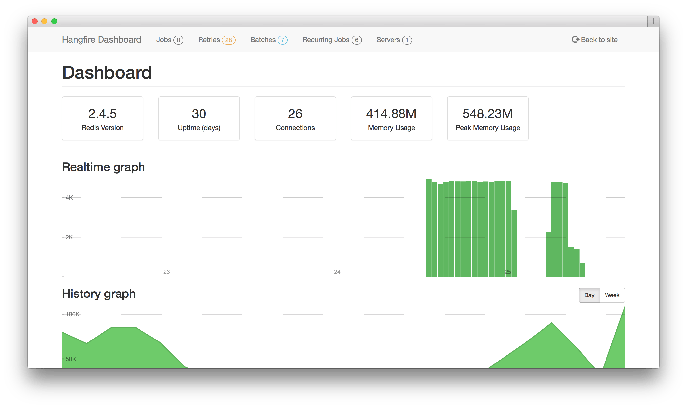


# Monkey

> Project Created by [**Top Nguyen**](http://topnguyen.net)
- Just add dependencies and use Framework, Core and Service (Contract only)
- Don't add all other project dependencies (reference)
- Follow [README](../../Puppy/Puppy.DependencyInjection/Readme.md) of `Puppy.DependencyInjection`

# Region/Areas Note
- I already have Area `Developers` for `API Docs` and `Background Job`
- Api Docs

  

  + We use generate doc by [`Swagger AspNetCore`](https://github.com/domaindrivendev/Swashbuckle.AspNetCore)
  + Access via: [root]/developers?key=[developer access key] (Config it in [appsettings.json](appsettings.json) with KEY `Developers:AccessKey`)

- Background Job

  

  + We use [Hangfire](https://www.hangfire.io/) with SQL Server (Can change it to Memory or Distribute Cache like Redis)
  + Access via: [root]/developers/job?key=[developer access key]

# Startup.cs Note
- I use nested file to configure startup (because it comming big guy).
- Each Startup Nested file will have 2 regions like example below
```c#
    public partial class Startup
    {
        public static class SomeConfig
        {
            public static void Service(IServiceCollection services)
            {
            }

            public static void Middleware(IApplicationBuilder app)
            {
            }
        }
    }
```

# API Note

- For Paging: use search keyword by `terms`, page size and page number by `skip` and `take`
- Api Response follow `ViewModels/Api`
- 3 Types of Response
  + [Success] Response `Collection`
  
	```c#
	var listSomeModel = await _someService.SomeMethodAsync(skip, take, terms).ConfigureAwait(true);

		if (listSomeModel.Total == 0)
		{ 
			// Return 204 for No Data Case
			return NoContent();
		}

		var collectionFactoryViewModel = new PagedCollectionFactoryViewModel<SomeModel>(PlaceholderLinkViewModel.ToCollection("<Api Pattern Endpoint>", HttpMethod.Get.Method, new { skip, take, terms }), "<Api Pattern Endpoint>");

		var collectionViewModel = collectionFactoryViewModel.CreateFrom(listSomeModel.Data, skip, take, listSomeModel.Total);

		return Ok(collectionViewModel);
	}
	```    

  + [Success] Response `Single`
    
    ```c#
	return Ok(<data>);
	```

  + [Fail] Response `Error`: throw [`MonkeyException`](../Monkey.Core/Exceptions/MonkeyException.cs) with [`ErrorCode`](../Monkey.Core/Exceptions/ErrorCode.cs) and return [`ApiErrorModel`](ViewModels/Api/ApiErrorViewModel.cs). refer to view [`ApiExceptionFilter`](ViewModels/Filters/ApiExceptionFilter.cs)

# Deploy Note

1. Create Publish Profile to Server through Visual Studio (Remember Create Server User to use in create profile wizard)
   - Manual right click of folder and click publish for make sure all file is published
   - launchSettings.json
   - Assets
   - template
   - api-doc.xml file
   - Files for SEO
2. Go to server Set `Application Pool .NET CLR Version` to `No Managed Code`
3. Advance Setting: `Always Running`, Load User Profile: `true`.
4. Go to deployed folder check and set full permission for users you use such as Default IIS user, Application Pool User.
   > If it not working, change user of application in IIS to `Local System`
5. Test
  - Go to deployed folder run CMD: dotnet <project dll/exe name>. Ex: dotnet Monkey.dll.
  - This action for test and view Console Log when start project in Server.
  - Final, `Ctrl + C` to shutdown test instance.

# Db Note

Remember to config DbContext if use Entity Framework in Startup, without it when run cmd in publish folder will throw null error
```csharp
// Use Entity Framework
// We can use EnvironmentName or MachineName to detect correct connection string.
services.AddDbContext<Data.EF.DbContext>(builder =>
builder.UseSqlServer(
    ConfigureHelper.Configuration.GetConnectionString(ConfigureHelper.Environment.EnvironmentName),
    options => options.MigrationsAssembly(typeof(IDataModule).GetTypeInfo().Assembly.GetName().Name)));
```

# Restful Note

```csharp
return NotFound(404)/Ok(200)/Created(201)/BadRequest(400) and so on Don't put simple type like string or int ...
Need create object/dynamic to response for aspcore can cast to json or xml (because http request header is json or xml)
If not follow this rule, exception occur then return no content + header error
```

# Hangfire Note

```csharp
// Let class PerResolveDependency if they have own method not in Interfaces
BackgroundJob.Enqueue(() => Method));	 // make sure Method is public and allow access from external assembly.

// Let use Job with Interface by DI
BackgroundJob.Enqueue<Interface>(x => x.Method));
```